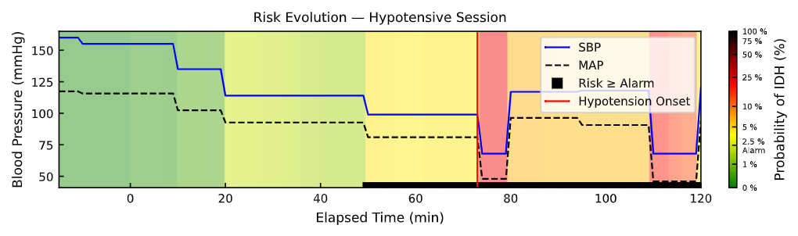
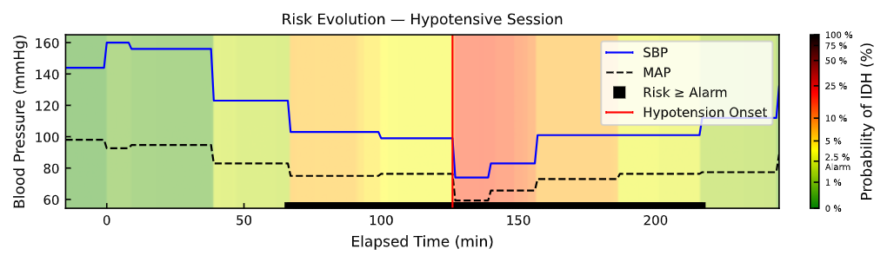
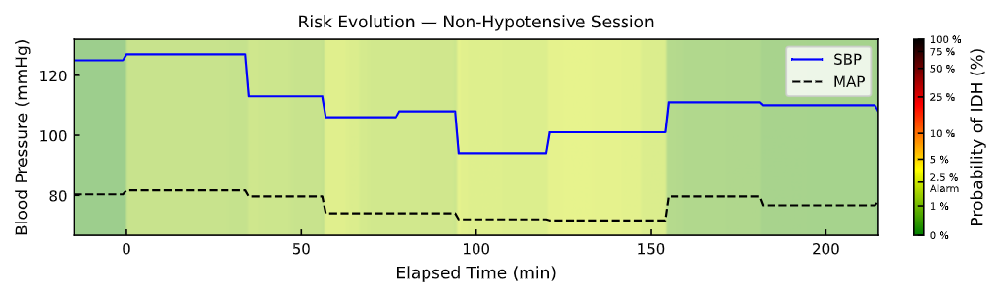
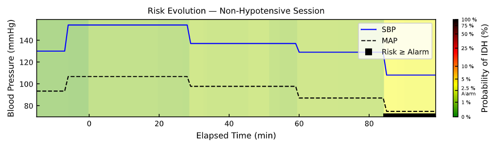
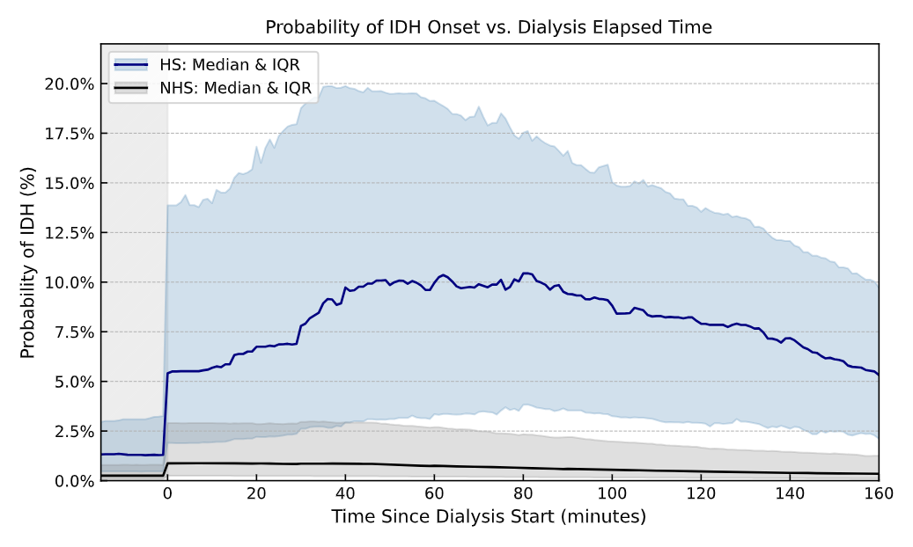
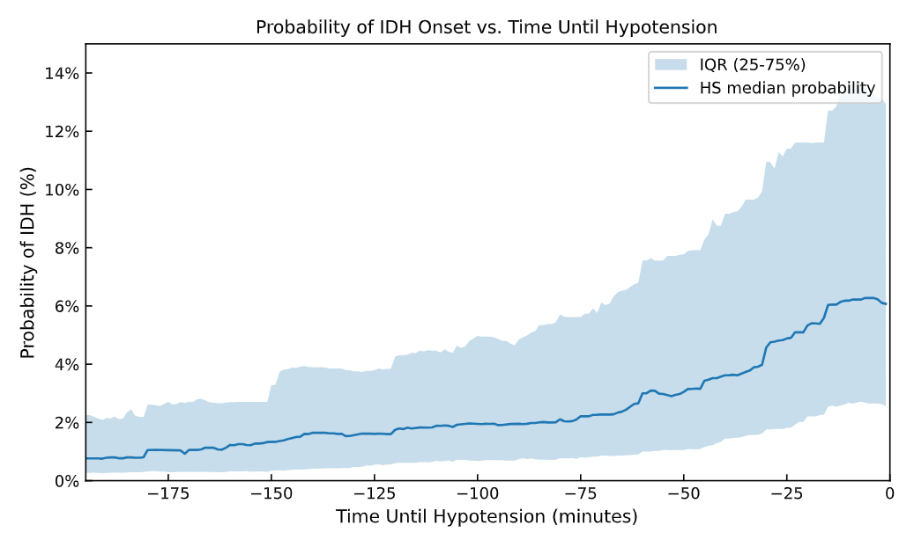

# Hypotension Forecasting Model

 ## Project's Goal
 Intradialytic hypotension (IDH) is a serious complication in dialysis patients, highly
 associated with fatal outcomes. This repository develops a real-time forecaster to predict IDH
 (SBP < 90 mmHg, MAP < 65 mmHg) within the subsequent 40 minutes of a dialysis session. 
 
 # Dataset Highlights
 The model was trained on 22,221 sessions from 3,627 patients (≈ 80% of sessions, 10.85%
 IDH rate) and validated on a held-out set of 5,797 sessions from 907 unseen patients
 (≈ 20%, 10.66% IDH rate). Data was sourced from multiple UPMC hospitals and
 featured a low median of 4 sessions per patient, ensuring patient variety. The methodology
 employed a strict stratification and cross-validation scheme to ensure generalization to
 new patients. Feature selection used penalized lasso-logistic regression, and the nal
 model was an XGBoost classifier, which handled the ≈ 1.5% observation-wise IDH
 incidence via penalized learning.

 ## Predictors
 Predictors included diverse transformations of vital-sign and dialysis-related
 signals (e.g., weighted averages, slopes, variability) evaluated over rolling, cumulative,
 and past-session information. The selection was done by means of a lasso constrained logistic regression 
 that provided the final 21 features for the model.

### Final Predictors List

* **General Demographics & Vitals**
  * Systolic Blood Pressure (SBP)
  * Mean Arterial Pressure (MAP)
  * Blood Flow Rate
  * Age

* **Ultrafiltration Metrics**
  * Current Total Ultrafiltration
  * Cumulative Ultrafiltration Rate (Time-Weighted Average)

* **45-Minute Window Statistics**
  * Minimum SBP
  * Minimum MAP
  * Maximum Pulse
  * Minimum Oxygen Saturation
  * Maximum Respiratory Rate

* **Historical & Previous Session Data**
  * Average SBP Delta (Last 6 Sessions)
  * IDH Incidence (Last 6 Sessions)
  * Maximum MAP Area Under the Threshold (Last 6 Sessions)
  * MAP Time-Weighted Average (Last Session)
  * SBP Variability (Last Session)
  * SBP Area Under the Threshold (Last Session)
  * SBP Variability at Last Hypotensive Onset

* **Cumulative Variability Metrics**
  * Cumulative SBP Variability
  * Cumulative Pulse Variability
  * Cumulative Dialysis Temperature Variability

 ## Performance and findings
 On unseen patients, the model achieved an area under the receiver operating curve of AUROC=0.878 and
 an area under the precision-recall curve of AUPRC = 0.132. Session-wise, it raised an alarm within 
 40 minutes before onset in 80.4% of hypotensive sessions. Observation-wise, it detected 73.0% of 
 pre-IDH events with a precision of 6.8%. 
 As a risk forecaster, the model achieved a calibrated log-loss of 0.061, with probability trajectories
 clearly identifying higher risk in hypotensive sessions. Model explanation confirmed blood 
 pressure signals and fuid-removal settings as top predictors. Novel findings include the
 greater importance of the time-weighted average of ultrafiltration rate compared to its
 instantaneous value, and the identification of seven predictors from earlier dialysis sessions
 that contribute to dynamic risk assessment in the current session.

## Risk Examples (Held-out set)
### Hypotensive Sessions

### Non-hypotensive sessions

## Risk Trajectories Summary
### Hypotensive and non-hypotensive sessions

### Hypotensive sessions

 ## Notes:
 - This is a curated subset of the project, showcasing the principal 
 components used to build a real-time forecaster for intradialytic hypotension 
 (40-minute horizon; SBP < 90 mmHg, MAP < 65 mmHg). It does not include the complete implementation or data.

 - The mathematical background of predictors and development insights will be included in a 
 thesis-like document after thesis publication.

 Best,
 your AI developer, Milton
